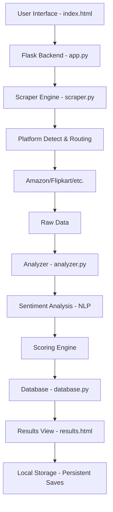

# AI-Based Multi-Platform Product Recommendation System

A premium, production-grade AI application that scrapes real-world product data from multiple e-commerce platforms, performs sentiment analysis on user reviews, and provides intelligent recommendations using a weighted scoring algorithm.

## 🚀 Key Features

- **Multi-Platform Scraping**: Real-time data collection from Amazon, Flipkart, Myntra, Snapdeal, Ajio, Meesho, and Nykaa.
- **AI-Powered Analysis**: 
  - **Sentiment Analysis**: Uses NLP to gauge customer satisfaction from reviews.
  - **Weighted Scoring**: Ranks products based on Price (40%), Rating (30%), and Sentiment (30%).
- **Premium Dashboard**: 
  - Glassmorphism UI with dark theme.
  - Interactive sorting and filtering.
  - Category-aware routing (e.g., Electronics → Amazon/Flipkart, Fashion → Myntra/Ajio).
- **Persistent State**: Save your favorite deals using browser `localStorage`.
- **Responsive Design**: Fully optimized for mobile, tablet, and desktop.

## 🛠️ Technology Stack

- **Backend**: Python, Flask
- **Database**: SQLite3 (Persistent results tracking)
- **Scraping**: BeautifulSoup4, DuckDuckGo Search API (Dynamic URL discovery)
- **Frontend**: HTML5 (Semantic), Vanilla CSS3, JavaScript (ES6+)
- **Design**: Modern Glassmorphism, Google Fonts (Outfit, Poppins)

## 📂 Project Architecture



## 🏗️ System Components

1.  **`app.py`**: The central controller handling routing, session management, and error handling.
2.  **`scraper.py`**: A robust engine that uses DuckDuckGo to bypass bot detection and find direct product links.
3.  **`analyzer.py`**: Performs natural language processing on scraped snippets to generate sentiment scores.
4.  **`database.py`**: Manages the SQLite schema and persists search history and global analytics.
5.  **`static/style.css`**: A comprehensive design system containing all animations, glass effects, and mobile-first layouts.

## 📈 Performance & Scalability

- **Optimized Loading**: Uses opacity transitions and subtle animations to hide network latency.
- **Resilient Fallbacks**: If a scraper fails or an image is missing, the system uses category-based fallback imagery and median-price estimation.
- **Accessibility**: ARIA-compliant UI with full keyboard support and screen reader optimization.

## 🚀 Deployment

### 1) GitHub
1. Initialize the repo if you haven’t already:
   ```bash
   git init
   git branch -M main
   git remote add origin https://github.com/<your-username>/<repo-name>.git
   git add .
   git commit -m "Initial deploy-ready commit"
   git push -u origin main
   ```
2. Replace `<your-username>` and `<repo-name>` with your GitHub account and repository name.

### 2) Render
1. Create an account at https://render.com and connect your GitHub repository.
2. Create a new **Web Service**.
3. Configure:
   - **Environment**: Python
   - **Build Command**: `pip install -r requirements.txt`
   - **Start Command**: `gunicorn app:app --bind 0.0.0.0:$PORT`
4. Add environment variables:
   - `SERPAPI_KEY` = your API key
   - `FLASK_DEBUG=false`
5. Deploy and open your service.

### 3) Vercel
- This project is not a native Vercel deployment because it is a Flask backend with server-rendered templates and SQLite.
- For Vercel, you would typically need to separate the frontend and host backend on Render or another Python host.

---
Built with ❤️ for the Final Year Project Showcase.
